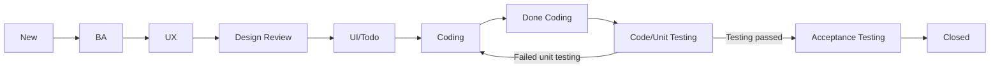

### People
- @people.Devi

### Notes
- As a group we started coming up with a workflow
- Get Devi a good artifact of the workflow
- 

```mermaid
    flowchart LR
    n[New]
    ba[BA]
    ux[UX]
    dr[Design Review]
    uit[UI/Todo]
    c[Coding]
    dc[Done Coding]
    unit[Code/Unit Testing]
    at[Acceptance Testing]
    closed[Closed]

    n-->ba
    ba-->ux 
    ux-->dr
    dr-->uit
    uit-->c
    c-->dc
    dc-->unit
    unit--Testing passed-->at
    unit--Failed unit testing-->c
    at-->closed

```
