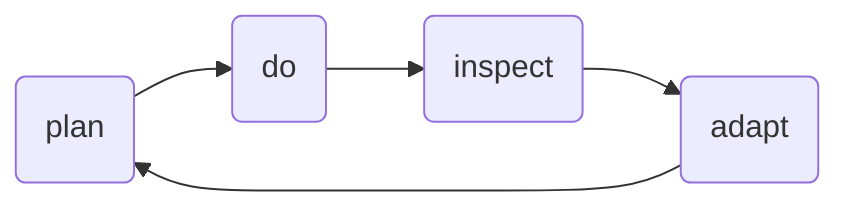

### Instructor
- Jan Beaver

## Logigistics
- Timing
- 2 Breaks each before lunch and after lunch
- Stay signed in during breaks and lunch, mute and turn off camera
- Don't get distracted
- 1.25 million CSM's worldwide!!
- Make sure camera stays on, VERY IMPORTANT
- Email will come from scrumalliance.org, use personal email address, within 10 minutes of finishing tomorrow
  - A self-assessment of 50 multiple choice questions, *open-book* test, need 37/50, 60 minute timebox, slidedeck is a great reference, 2 attempts
  - Accept the license and trademark
  - Certification is good for 2 years, renewal is $100, document 20 hours of scrum education, on scrum alliance site

## Process Control Models
- Defined process control (outdated)
  - Causal determinism
    - "Plan the work, work the plan"
    - Reality does NOT care about our plans, this doesn't work
    - Focuses on:
      - Efficiency
      - Utilization (butts in seats)
    - Assembly line of (Model T's) is really when it worked the best 
  - Software and IT was defined by this to our detriment
- Empirical Process Control
  - Knowledge from experience and make decisions based on observations from the work
  - "Scrum is iterative, incremental approach to optimize predictability and control risk"
  - 3 pillars
    - Transparency
    - Inspection
    - Adaptation
  - We need Empirical Process Control because of the Complex Work
    - Emerged from the uniqueness of software
    - Software is always new, if it already existed why would we recreate it
      - Reuse as much as possible
    - Stakeholders don't know what they want, they will change their minds
    - We don't know what we're creating, let alone *how* to do it!
## The Agile Manifesto
- Agile Manifesto Principles
  - Discuss each one, discuss into 3 words

## Scrum
### Origins of Scrum
- 'Relay race' approach is akin to waterfall!
- A holistic or 'rugby' approach - where a team tries to go the distance as a unit, passing the ball back and forth
  - Small, cross functional, highly skilled individuals, self-managed
- *Havard Business Review*, "The New New Product Development Game"
### Overview
- Roles are the accountabilities
### Continuous Improvement
- Plan, Do, Inspect, Adapt

### Values
- Treat people the way *they* want to be treate

- Put people in a position to take action
- Characteristics are like jigsaw puzzle pieces, each element, by itself, does not bring about speed and flexibility. Taken as a whole, the characteristics can produce a powerful new set of dynamics that will make a difference

- Scrum Master training is great for everyone, formal training is definitely recommended
### The Scrum Team
- Accountable for all product-related activities
- Stakeholder collaboration
- Product development & maintenance
- Cross-functional
- Self-managing
  - This is NOT a boss, someone who dictates what needs to be done
- Works at a sustainable pace
  - And is *accountable* for this
- Collective accountability for creating a valuable, useful product Increment every Sprint
  - No busy work
- Full-time, dedicated Team members
  - A team is a team!!!
  - Try playing for the Cavs and the Lakers at the same time :-)
#### Scrum Master
- Accountable for Team's effective use of Scrum
- Removes barriers, facilitates effective communication, enables teamwork
- Shields the team from external interference
- Team facilitator, teacher, mentor, & coach
  - Not realistic for SM to train everyone on the team on Scrum
- Facilitates all Scrum Events
- Organizational Scrum coach and change agent
- Leads by example and influence, not managerial authority
  - Interpersonal relationships
  - Servant leader
- Increases openness and visibility of impediments and successes
  - Putting people in the right place for success
  - Celebrate successes and wins
- *Everyone* needs to be bought-in!!!!
  - Fist of Five, Thumbs up/sideways/down, dot voting
- Listen and provide options
- Where there's lag, find a SME and fill in that gap

#### Product Owner
- Defines and share the Product Goal
- Defines the content and ordering of the Product Backlog
- Decided when to release based on emergent product features
- Owns the product development budget
- Is the focal point for stakeholders, customers, SMEs, etc.
- Max the value of the Developers' work
- Accepts or rejects work results
- Participats in Backlog Refinement, Sprint Planning, Sprint Review, Daily Scrum (Optional), and Sprint Retrospective
- Makes sure the Team always has something to work on

#### Developers
- Accountable for delivering a quality product at a sustainable pace
- Size: 3 - 8 people
  - Scale by building more teams
- Full-time, dedicated to one Scrum Team only
- No titles other than "Developer"
  - This does not mean other skills are ignored ;)
- Cross-functional and collaborative
- Self-managing - collectively decide who does what and when
- Own all work item estimates
  - They tell the Product Owner how long something will take to develop
- Accountable for improving engineering practices (quality)
  - Stay up-to-date on the latest technologies
- Demonstrate Product Increment to Product Owner and stakeholders every Sprint
- Full participation in all Scrum Events/Activities
- They determine when the work is going to get done, they set the pace

### Team Development
- Forming, Storming, Norming, Performing
  - Creative conflict
- Whenever the team changes, we go back to a "Forming" phase
- Optimize for the humans! (Scrum does this)
- Keep teams challenged and refreshed
- Conversational equality
- Celebrate the fails, what was learned
  - Failure is part of the human condition
- Fixed team roster, helps simplify the budget

### Scrum Events
- Sprint planning
- Daily Scrums
  - Backlog refinements as needed
- Sprint review
- Sprint retrospective
- 1-2 week sprints are preferred and most common
  - NO to 3-4 week sprints, things tend to slow down

#### Sprint Planning
- Two-sprint = 4 hour time box (our deadline)

#### Daily Scrum
- It's for the developers, PO's need to behave themselves
- What happened in the last 24 hours and what's coming up in the next 24 hours

#### Sprint Review
- Share with stakeholders, are we on the right path, get their feedback

#### Retros
- Without retros, we lose the opportunity to improve ourselves
- Make the retros relevant!
- People should look forward to them the most!
- Performing teams look forward to these the most

### Product Goal
- The desired outcome of the product
  - Idea --> Goal --> Release
  - Good product goal, 100 words or less
    - Elevator pitch (in tallest building)
    - Shared and unifying
    - Broad and engaging
    - Brief and easy to consume
    - Fosters simplicity and innovation
    - iPod's product goal
      - 

### The Product Backlog
- Single-dimensional, **ordered** list of everything needed for the product
  - If it's NOT in the backlog, we are NOT doing it
  - All items into the future
- Commitment: Product Goal
- Artifact: Product backlog
- Each item provides value to the business, end users, or customers
- Ordered by hte Product Owner
  - Re-ordered for the start of each Sprint
  - Dynamic - can change at any time
  - Each item has: Description, Order, Estimate, Value
- Sprint backlog is a slice off the top of this, and it should NOT be disrupted
- Developers tell the PO and SM what the estimate is
#### User Stories
- Comes from XP, not Scrum but is borrowed
- A Thin, vertical slice of valuable functionality as told from the perspective of the end user
  - Slice through the whole tech stack
  - You wouldn't pull a layer out of cake, you would slice it vertically, experience is the same with each slice (usually)
  - Focuses the developers to work together, cross-functional
- Get stakeholders thinking in-terms of customer value, what the customer needs/wants
- Scrum Master's job is to make sure the Fan 4's are happening and they are effective
- Why user stories?
  - "Voice of the customer" thread throughout the process
  - Very small complex independent problems
- Definition of Ready (for Sprint Planning)
  - INVEST

### Sprints
- Nothing happens outside the boundaries of the Sprint (event)
- Duration is fixed, it should be permanent, if it changes it should be a permanent change!
  - Typically 1-2 weeks
  - We *need* to control the time, otherwise our work will determine it
    - Slice work to fit within time
- Protected from *external* interruptions/scope changes
  - Protect the Sprint Plan
  - "Because I said so" doesn't work in Scrum
    - The PO needs to protect the Sprint Plan
#### Sprint Backlog
- A slice off the top of the Product Backlog
- Extremely transparent, a real-time snapshot (this is the "status update")
- Developers, self-manage their work
- Sprint Backlog visualized
- There's "Not Done" and "Done" at the most basic level
  - "In-Progress" falls under "Not Done"
- Minimize waste - minimize work in Sprint
#### Sprint Cadence
- 
- Don't choose Sprint Planning for Mondays
  - People are tired, not into it
  - Holidays typically fall on Monday's
    - Pushing it out to Tuesday makes a big deal
    - Plan less work on Holidays
  - Sprint Review, take a break, Retro
  - Go into the next day and start with Sprint Planning
- We should NOT be exhausted, because we work at a sustainable pace
#### Canceling a Sprint Plan
- If the Sprint Goal becomes obsolete
  - The Sprint Plan may be canceled
- This is an extreme circumstance, the exception
- Sprints are too long or the PO doesn't have focus
- PO has authority to cancel the Sprint Plan, accountable for the budget ramifications
- The Sprint does NOT get canceled!!

#### Product Increment
- Artifact: Product Increment
- Commitment: Definiton of Done
  - Created, owned and committed to by the Developers
  - If multiple teams, need to come up with a shared DoD
- Shift focus of DoD to the Product Increment, can be used at the story level, but be careful to not change quality per story
- The Quality of work
- There is no value added in FIXING bugs, we want to PREVENT them
- New requirements/agreements = new story, no if's/and/buts!

### Technical Debt
- Super easy to create
- Poor implementation, quality, code yet to be integrated
- Lack of test coverage, work-in-progress, doesn't meet naming conventions
- Major source of bugs
  - Need to be fixed or the debt piles up
- Developers are accountable for this
- Metaphor - credit card debt, interest accruing, needs to be paid off

#### Practices to Prevent Tech Debt
- Agile architecture
- Modern programming practices
- Continuous refactoring
- Automated Unit Tests
- TDD - red-green-refactor coding cycle
- Continuous Integration
- Static analysis
- Automated functional tests

### Story Points
- Includes effort, complexity, risk
- Relative size of numbers
- "How big is this?" is fundamentally easier to answer than "How long will this take?"
- Separates estimates from commitments
- Apply timebox to Spikes/chores
- All Developers need to agree on the size!
- Conceptualization of work
- Does NOT indicate the number of hours it takes
  - If only 3 choices are needed, just stick with T-Shirt sizes
- Anything that slows us down is not good
- What we got done last sprint is a good indication of what we can get done in the next sprint
- Consistency is important vs. precision, this way we can use velocity as a valuable estimation metric

Scrum is minimally perscriptive

### Questions
- I asked about having a PO being the manager of several developers and coming to the retro
  - We do NOT want hierarchy within the Scrum team, it does not work
    - It does not work with humans
- Where do Continuous Improvement and Innovation fit?
  - It happens daily just by practicing Scrum, and retros
  - Put Innovation Days and things like that in the backlog!
- Fan 4's should be done BEFORE the Sprint Planning, NOT during the Sprint
- Create awareness, "New thing!", "Want to try this?", feed insights into team
  - If they say no to something, keep trying a little slice at a time, "Let's just try it" timebox
  - Find the right level of engagement, it could shift from day-to-day and hour-to-hour, what's the vibe
  - SM's domain is Human interaction, psychology
  - His mentor is: Jeff McKenna, who got a degree is Family Counseling to become a great SM

### Miscellaneous
- Ken Schwaber started Scrum.org, big in eastern Europe
  - Ken was with ScrumAlliance, big clash of egos, so he started his own
- ScrumAlliance.org is used throughout the rest of the world typically, 10x bigger than Scrum.org

### Action items
#todos
- [x] Download and review Scrum Master Checklist
- [ ] Book - *Agile Retrospectives: Making Good Teams Great*
- [x] Read Scrum Guide before taking the exam